# Hi there, I'm [Jude](https://github.com/iammrjude) :wave:

## Welcome to my GitHub profile :beach_umbrella:

I'm a passionate software developer who is always ready to learn new
technologies. I enjoy turning ideas into polished products with elegant
interfaces, and I care deeply about user experience, architecture, and code
quality.

I have 6+ years of experience in Python and web development, plus 4+ years of
blockchain experience across Ethereum, BSC, Polygon, Heco, Avalanche, Base, and
Sonic.

## How to reach me

- Discord: `jude#6067`
- Telegram: [@judedotsol](https://t.me/judedotsol)
- Email: [judedev406@gmail.com](mailto:judedev406@gmail.com)
- If you have any questions, feedback, or freelance opportunities, please feel
  free to reach out.

## Technologies and tools

## GitHub stats

## My interests

- DeFi
- GameFi
- DAOs

## Experience

- Built ERC20 tokens, deflationary tokens, minting systems, staking products,
  and multi-reward staking systems.
- Built DEXs, DeFi products, and DAOs on Ethereum, BSC, Polygon, Heco,
  Avalanche, Base, and Sonic.
